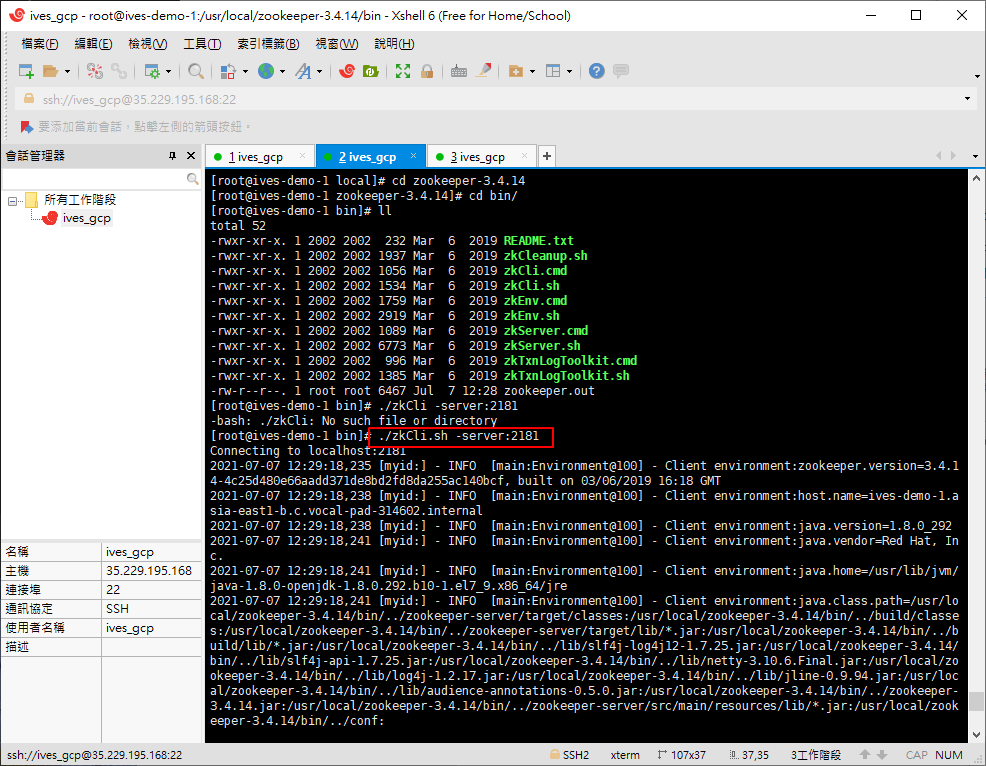
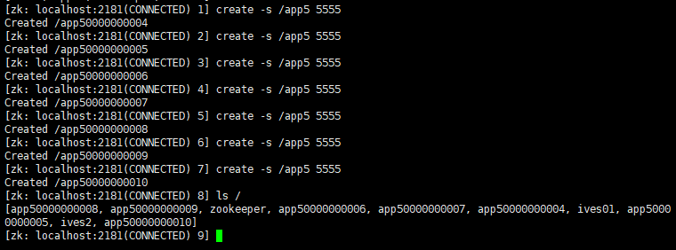

# Java ZooKeeper

ZooKeeper筆記

# ZooKeeper 概念

- ZooKeeper是Apache Hadoop項目下的一個子項目，是一個樹形目錄服務。
- ZooKeeper翻譯過來就是動物管理員，它是用來管理Hadoop(大象)、Hive(蜜峰)、Pig(小豬)的管理員，簡稱zk。
- ZooKeeper是一個分布式、開源的分布式應用程序的協調服務。
- ZooKeeper提供的主要功能包括：
    + 配置管理
    + 分布式鎖
    + 集群管理

# ZooKeeper 數據模型

- ZooKeeper是一個樹形目錄服務，其數據模型和Unix的文件系統目錄樹很類似，擁有一個層次化結構。
- 這裡面的每一個節點都被稱為： ZNode，每個節點都會保存自己的數據和節點信息。
- 節點可以擁有子節點，同時也允許少量(1MB)數據存儲在該節點之下。
- 節點可以分為四大類
    + PERSISTENT 持久化節點
    + EPHEMERAL 臨時節點： -e
    + PERSISTEN_SEQUENTIAL 持久化順序節點： -s
    + EPHEMERAL_SEQUENTIAL 臨時順序節點： -es
# 安裝jdk

## 使用GCP的服務器

```bash
 yum  install  -y  java-1.8.0-openjdk.x86_64
 java -verson
```


# ZooKeeper 下載與安裝


下載點

https://archive.apache.org/dist/zookeeper/zookeeper-3.4.14/


使用wget下載

```bash
wget https://archive.apache.org/dist/zookeeper/zookeeper-3.4.14/zookeeper-3.4.14.tar.gz
tar -zxvf zookeeper-3.4.14.tar.gz
cd zookeeper-3.4.14
cd conf/
cp zoo_sample.cfg zoo.cfg
cd ..
cd bin/
./zkServer.sh start
```

成功運行服務器


運行客戶端

再開一個視窗

```bash
cd /usr/local/zookeeper-3.4.14/bin
./zkCli.sh -server:2181
```



# ZooKeeper 服務端常用命令

啟動服務端器

```bash
./zkServer.sh start

```

停止服務器

```bash
./zkServer.sh stop
```

重啟服務器

```bash
./zkServer.sh restart
```

查看服務器狀態

```bash
./zkServer.sh status
```


啟動客戶端

```bash
./zkCli.sh -server:2181
```

查看節點

```bash
ls /
```

創建節點

```bash
create /ives01 hellozoo
```

創建臨時節點(客戶端斷線，該節點即會消失)

```bash
create -e /app01 hellozoo
```

創建順序節點

```bash
create -s /app5 5555
```



創建順序臨時節點(客戶端斷線，該節點即會消失)

```bash
create -e -s /app555 kkk
```

讀取節點

```bash
get /ives01
```

獲取節點狀態

```bash
stat /ives02 hihi~nana
```


設定節點

```bash
set /ives02 hihi~nana
```

刪除節點

```bash
delete /ives02
```

刪除全部節點(3.5.6的版本適用)

```bash
delete /ives02
```

3.4的版本要一個一個的刪

help可以查看指令

```bash
help
```

離開客戶端

```bash
quit
```

查看子節點及信息

```bash
ls2 /ives2
```

3.5.6的版本使用ls -s /ives2


節點信息參考表

```bash
cZxid # 創建節點的事務id
ctime # 創建節點的時間
mZxid # 修改節點的事務id
mtime # 修改節點的時間
pZxid # 子節點列表最後一次修改的事務id。刪除或添加子節點，不包含修改子節點的數據。
cversion # 子節點的版本號，刪除或添加子節點，版本號會自增
dataVersion # 節點數據版本號，數據寫入操作，版本號會遞增
aclVersion # 節點ACL權限版本，權限寫入操作，版本號會遞增
ephemeralOwner # 臨時節點創建時的事務id，如果節點是永久節點，則它的值為0
dataLength # 節點數據長度（單位：byte），中文佔3個byte
numChildren # 子節點數量
```

# ZooKeeper JavaAPI 操作

## Curator 介紹

- Curator是Apache ZooKeeper的Java客戶端庫。
- 常見的ZooKeeper Java API：
    + 原生Java Api
    + ZkClient
    + Curator
- Curator項目的目標是簡化ZooKeeper客戶端的使用。
- Curator最初是NetFix研發的，後來捐獻給Apache基金會，目前是Apache的頂級項目。  

官網

https://curator.apache.org/


## ZooKeeper Version 3.4.x Compatibility

https://curator.apache.org/zk-compatibility-34.html

